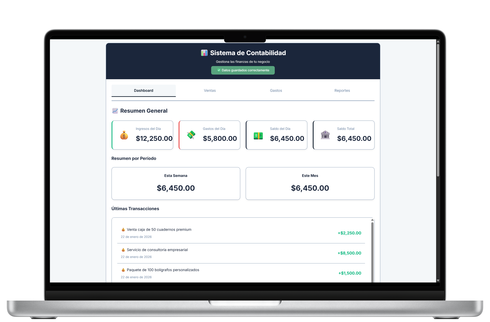
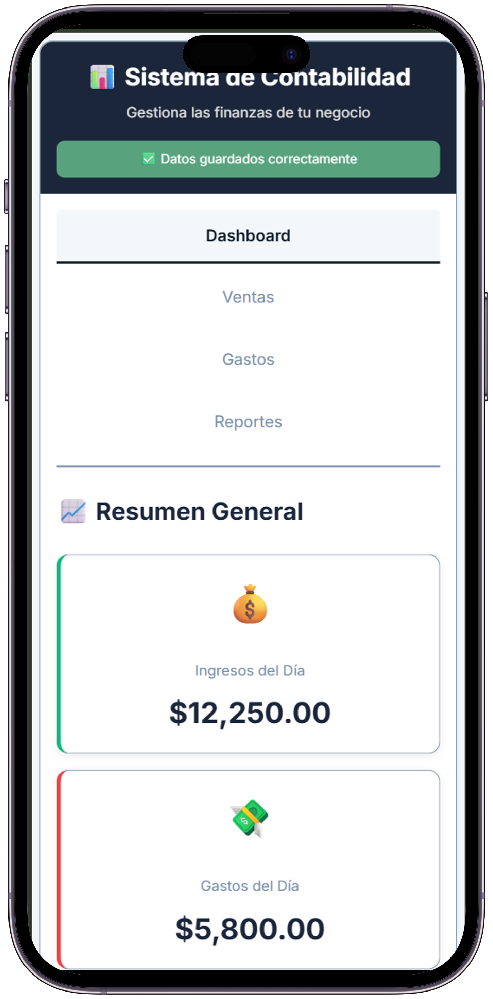
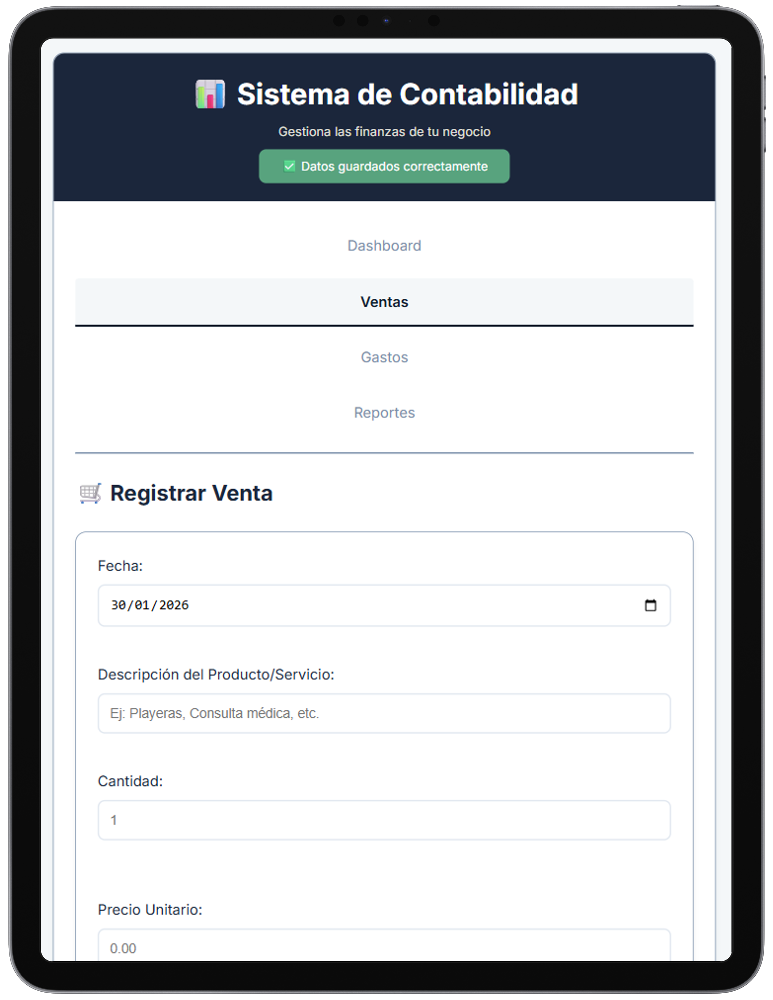
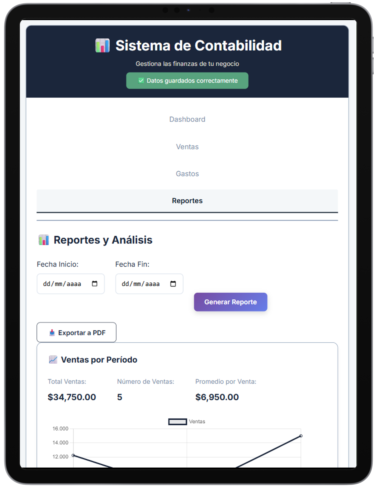

# 💰 Sistema de Contabilidad

Sistema completo de contabilidad para negocios pequeños con funcionalidad offline y análisis en tiempo real.



## ✨ Características

- 📊 **Dashboard en tiempo real** con resumen financiero
- 💵 **Registro de ventas** con cálculo automático
- 💸 **Gestión de gastos** por categorías
- 📈 **Reportes visuales** con gráficas interactivas
- 📄 **Exportación a PDF** para compartir
- 💾 **Funciona offline** - PWA instalable
- 📱 **100% responsive** - Mobile-first

## 🛠️ Stack Técnico

- **Frontend:** HTML5, CSS3, JavaScript ES6+
- **Almacenamiento:** IndexedDB + localStorage (dual backup)
- **Visualización:** Chart.js para gráficas
- **Exportación:** jsPDF para reportes
- **PWA:** Service Workers + manifest.json

## 🚀 Demo

🔗 [Ver demo en vivo](https://tu-username.vercel.app) *(Próximamente)*

## 📱 Diseño Responsive

La aplicación se adapta perfectamente a cualquier dispositivo:



*Sistema completamente funcional en smartphones*

## 💡 Aprendizajes Clave

- Implementación de PWA completa con funcionalidad offline
- Arquitectura de almacenamiento dual (IndexedDB + localStorage)
- Sistema de respaldo y sincronización entre dispositivos
- Generación dinámica de reportes PDF con gráficas
- Manejo de estado sin frameworks

## 📸 Capturas de Pantalla

### Dashboard Principal

*Vista principal con resumen financiero en tiempo real*

### Gestión de Ventas


*Formulario intuitivo para registro rápido de ventas*

### Reportes y Análisis


*Análisis visual con gráficas interactivas de Chart.js*

### Vista Móvil


*Experiencia optimizada para smartphones*

## 🎯 Funcionalidades Principales

1. **Dashboard Financiero**
   - Ingresos y gastos del día en tiempo real
   - Saldo diario, semanal y mensual
   - Últimas transacciones registradas

2. **Gestión de Ventas**
   - Registro rápido con cálculo automático
   - Múltiples métodos de pago
   - Historial completo de ventas

3. **Control de Gastos**
   - Categorización por tipo de gasto
   - Filtros por fecha y categoría
   - Seguimiento de egresos

4. **Reportes Visuales**
   - Gráficas de ventas por período
   - Análisis de gastos por categoría
   - Comparativa mensual
   - Productos más vendidos

5. **Exportación a PDF**
   - Reportes profesionales listos para imprimir
   - Incluye gráficas y resumen ejecutivo

## 🔧 Instalación y Uso

```bash
# No requiere instalación
# Solo abre index.html en tu navegador

# Para funcionalidad PWA (offline):
# Abre con un servidor local
python -m http.server 8000
# Luego ve a: http://localhost:8000
```

## 📂 Estructura del Proyecto

```
├── index.html              # Página principal
├── estilos.css            # Estilos de la aplicación
├── app.js                 # Lógica de negocio
├── service-worker.js      # Service Worker para PWA
├── manifest.json          # Configuración PWA
├── icon-192.png           # Ícono PWA 192x192
└── icon-512.png           # Ícono PWA 512x512
```

## 🚀 Características Técnicas

- **Sin dependencias externas** - Funciona standalone
- **Almacenamiento robusto** - IndexedDB como principal, localStorage como backup
- **PWA completa** - Instalable y funciona offline
- **Responsive design** - Mobile-first approach
- **Chart.js** - Gráficas profesionales
- **jsPDF** - Generación de reportes PDF

## 🔜 Mejoras Futuras

- [ ] Integración con APIs de bancos
- [ ] Múltiples empresas/usuarios
- [ ] Sincronización en la nube
- [ ] Notificaciones push
- [ ] Reportes más avanzados
- [ ] Export a Excel

## 📄 Licencia

Este proyecto es de código abierto bajo licencia MIT.

---

**Desarrollado por Gabriel Zeref** | 📧 tu@email.com | [LinkedIn](tu-linkedin) | [GitHub](tu-github)

**Stack:** HTML5 · CSS3 · JavaScript · IndexedDB · Chart.js · PWA